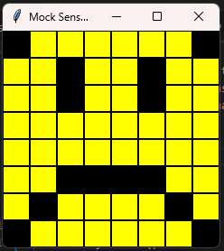
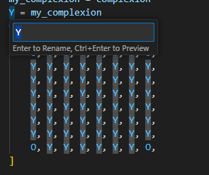

# Evidence and Knowledge

This document includes instructions and knowledge questions that must be completed to receive a *Competent* grade on this portfolio task.

## 1. Required evidence

### 1.1. Answer all questions in this document

- Each answer should be complete, well-articulated, and within the specified word count limits (if added) for each question.
- Please make sure **all** external sources are properly cited.
- You must **use your own words**. Please include your full chat transcripts if you use generative AI in any way.
- Generative AI hallucinates, is not an authoritative source

### 1.2. Make all the required modifications to the code

- Please follow the instructions in this document to make the changes needed to the code.

- When requested to upload evidence, upload all screenshots to `screenshots/` and embed them in this document. For example:

```markdown

```


> Note the `!`, and the use of a relative path.

- You must upload the code into your GitHub repository.
- While you can use a branch, your code should be in main when you submit.
- Upload a zip of this repository to Blackboard when you are ready to submit.
- You will be notified of your result via Blackboard
- However, if using GitHub classrooms, you may also receive additional feedback on GitHub directly

### 1.3. Optional: Use of Raspberry Pi and SenseHat

Raspberry Pi or SenseHat is **optional** for this activity. You can use the included `sense_hat.py` file to simulate the SenseHat on your computer.

If you use a Pi, please **delete** the `sense_hat.py` file.

### 1.4. Accessible version of the code

This project relies on visual patterns that appear on an LED matrix. If you have any accessibility requirements, you can use the `udl/accessible` branch to complete the project. This branch provides an accessible code version that uses text-based patterns instead of visual ones.

Please discuss this with your lecturer before using that branch.

## 2. Specific Tasks & Questions

Address the following tasks and questions based on the code provided in this repository.

### 2.1. Set up the project locally

1. Fork this repository (if not using GitHub Classrooms)
2. Clone your repository locally
3. Run the project locally by executing the `main.py` file
4. Evidence this by providing screenshots of the project directory structure and the output of the `main.py` file


If you are running on a Raspberry Pi, you can use the following command to run the project and then screenshot the result:

```bash
ls
python3 main.py
```

### 2.2. Fundamental code comprehension

 Answer each of the following questions **as they relate to that code** supplied by in this repository (ignore `sense_hat.py`):

1. Examine the code for the `smiley.py` file and provide  an example of a variable of each of the following types and their corresponding values (`_` should be replaced with the appropriate values):

   | Type                    | name       | value          |
   | ----------              | ---------- | -------------- |
   | built-in primitive type | dimmed          |  True             |
   | built-in composite type | pixels        |  [            O, Y, Y, Y, Y, Y, Y, O,Y, Y, Y, Y, Y, Y, Y, Y, Y, Y, Y, Y, Y, Y, Y, Y,Y, Y, Y, Y, Y, Y, Y, Y,Y, Y, Y, Y, Y, Y, Y, Y,Y, Y, Y, Y, Y, Y, Y, Y,Y, Y, Y, Y, Y, Y, Y, Y,O, Y, Y, Y, Y, Y, Y, O,]
   | user-defined type       | sense_hat          |  SenseHat()             |

2. Fill in (`_`) the following table based on the code in `smiley.py`:

   | Object                   | Type                    |
   | ------------             | ----------------------- |
   | self.pixels              |        list                |
   | A member of self.pixels  | Constant/Tuple                   |
   | self                     | Smiley                       |

3. Examine the code for `smiley.py`, `sad.py`, and `happy.py`. Give an example of each of the following control structures using an example from **each** of these files. Include the first line and the line range:

   | Control Flow | File       | First line  | Line range  |
   | ------------ | ---------- | ----------- | ----------- |
   |  sequence    |  smiley.py         |    11        | 11-26           |
   |  selection   | sad.py          | 26           | 26-29           |
   |  iteration   | happy.py          | 30           | 30-31           |

4. Though everything in Python is an object, it is sometimes said to have four "primitive" types. Examining the three files `smiley.py`, `sad.py`, and `happy.py`, identify which of the following types are used in any of these files, and give an example of each (use an example from the code, if applicable, otherwise provide an example of your own):

   | Type                    | Used? | Example |
   | ----------------------- | ----- | --------|
   | int                     | Yes     | in smiley.py the Constant WHITE uses a tuple of integers to define the colour of the pixel.         |
   | float                   | yes     | In happy.py in the def(blink) has a variable called "delay" which uses a float to determine the delay of the blink.          |
   | str                     | no     | The application does not use any strings, which would be a variable that contains text          |
   | bool                    | yes     | in sad.py the draw_eyes function has a variable called wide_open that is by default set to True.          |

5. Examining `smiley.py`, provide an example of a class variable and an instance variable (attribute). Explain **why** one is defined as a class variable and the other as an instance variable.

> In smiley.py, a class variable is the constant WHITE, an instance variable is self.pixels.
>
>WHITE is defined as a class variable as it is a variable that will be shared by all instances of the class. This means that every instance of the Smiley class will have a variable to define the colour white.
>
>self.pixels is defined as an instance variable so that it is owned by instances of the class. This means that every new Smiley object that is created allows for each object or instance to have different values assigned to self.pixels.

6. Examine `happy.py`, and identify the constructor (initializer) for the `Happy` class:
   1. What is the purpose of a constructor (in general) and this one (in particular)?

   >```def __init__``` is the constructor for the Happy class.
   >
   >its purpose is to intialize the parent attributes and attributes for the Smiley class.
   2. What statement(s) does it execute (consider the `super` call), and what is the result?

   >Firstly, the super call executes intializing the attributes for the Smiley and Blinkable. it then executes the "draw_mouth()" function, which Renders a mouth by blanking the pixels that form that object. After this it executes the "draw_eyes()" function which Draws the eyes (open or closed) on the standard smiley. As the "wide_open" variable is not defined when calling the function, it will default to the self.BLANK option.
   >

### 2.3. Code style

1. What code style is used in the code? Is it likely to be the same as the code style used in the SenseHat? Give to reasons as to why/why not:

> It appears to be PEP 8.
>
>It is likely to be the same in sensehat, as PEP 8 is a very common code style for python, and will help it's readability for others.

2. List three aspects of this convention you see applied in the code.

>It follows the style guide for constants being in all caps, the class names using CapWords convention, and variables are using lowercase with words seperated by underscores
>

3. Give two examples of organizational documentation in the code.

> 1. in smiley.py there is an inline comment on line 12
>2. in smiley.py there is a multi line comment on line 29 that is attached to the function
>

### 2.4. Identifying and understanding classes

> Note: Ignore the `sense_hat.py` file when answering the questions below

1. List all the classes you identified in the project. Indicate which classes are base classes and which are subclasses. For subclasses, identify all direct base classes.
  
  Use the following table for your answers:

| Class Name | Super or Sub? | Direct parent(s) |
| ---------- | ------------- | ---------------- |
| Smiley    | Super           | none    |
|   Happy      |   Sub         |      Smiley, Blinkable         |
|   Sad      |   Sub         |      Smiley         |
|   Blinkable      |   super         |      none       |

2. Explain the concept of abstraction, giving an example from the project (note "implementing an ABC" is **not** in itself an example of abstraction). (Max 150 words)

> Abstraction is the method of only showing essential features and hiding internal details that are complex or not required to be visible to the user. 
>
>An example is in blinkable.py, which defines the abstractmethod blink. This means that any class that inherits the Blinkable class, will need to implement the blink function.

3. What is the name of the process of deriving from base classes? What is its purpose in this project? (Max 150 words)

> This process is called inheritance. In this process it is used to define the base class Smiley, which contains the basic structure of the smiley face, while the Happy and Sad Classes inherit these functions and variables and add their own functions and variables to alter it but keeping the base structure.
>

### 2.5. Compare and contrast classes

Compare and contrast the classes Happy and Sad.

1. What is the key difference between the two classes?
   > One displays a Happy smiley face, the other displays a sad smiley face
   >
2. What are the key similarities?
   > They both inherit the Smiley clase

3. What difference stands out the most to you and why?
   > The Happy class inherits the Blinkable abstract class while the Sad class does note. This is because the Blinkable class is an abstract class.
   >
4. How does this difference affect the functionality of these classes
   > It means the Happy class can blink but the Sad class can not.
   >

### 2.6. Where is the Sense(Hat) in the code?

1. Which class(es) utilize the functionality of the SenseHat?
   > Smiley, but so do Happy and Sad since they inherit the Smiley class
   >
2. Which of these classes directly interact with the SenseHat functionalities?
   > Smiley
   >
3. Discuss the hiding of the SenseHAT in terms of encapsulation (100-200 Words)
   > The hiding of the SenseHAT means that when others look into the code they will not need to understand the protocol required to talk to the SenseHAT, and instead can use the pre-configured colours that are defined in the Smiley class.
   >
   >This also means that all of the instructions sent to the SenseHAT are consistent, and others using the code cannot easily send commands to the SenseHAT that may cause errors.

### 2.7. Sad Smileys Can’t Blink (Or Can They?)

Unlike the `Happy` smiley, the current implementation of the `Sad` smiley does not possess the ability to blink. Let's first explore how blinking has been implemented in the Happy Smiley by examining the blink() method, which takes one argument that determines the duration of the blink.

**Understanding Blink Mechanism:**

1. Does the code's author believe that every `Smiley` should be able to blink? Explain.

> No, if they did believe this, they would have defined the blink function in the Smiley class so that it would be inherited with every class that has Smiley as a parent.
>

2. For those smileys that blink, does the author expect them to blink in the same way? Explain.

> No, this is because they made the Blinkable class an abstract class, meaning that each Smiley that inherits the Blinkable class needs to define their own method for blink. If they wanted them to blink the same way, they would have not used an Abstract class and instead made the Blinkable class define the Blink method to be inherited.
>

3. Referring to the implementation of blink in the Happy and Sad Smiley classes, give a brief explanation of what polymorphism is.

> In the case of blink the Happy and Sad smiley classes, polymorphism would refer to both having a `blink` method which when used on the different class objects, would do similar actions that differ depending on the class of object.
>

4. How is inheritance used in the blink method, and why is it important for polymorphism?

> It uses an abstract class in the Blinkable class, which requires any class that inherits Blinkable to define the `blink` method, meaning that it enforces polymorphism for any class that inherits it.
>
1. **Implement Blink in Sad Class:**

   - Create a new method called `blink` within the Sad class. Ensure you use the same method signature as in the Happy class:

   ```python
   def blink(self, delay=0.25):
      self.draw_eyes(wide_open=False)
      self.show()
      time.sleep(delay)
      self.draw_eyes(wide_open=True)
      self.show()
   ```

2. **Code Implementation:** Implement the code that allows the Sad smiley to blink. Use the implementation from the Happy Smiley as a reference. Ensure your new method functions similarly by controlling the blink duration through the `delay` argument.

3. **Testing the Implementation:**

- Test the new blink functionality on your Raspberry Pi or within the Python classes provided. You might need to adjust the `main.py` script to incorporate Sad Smiley's new blinking capability.

Include a screenshot of the sad smiley or the modified `main.py`:



- Observe and document the Sad smiley as it blinks its eyes. Describe any adjustments or issues encountered during implementation.

  > I had to change the main.py script to import the Sad class and show the Sad smiley class instead of the Happy Smiley class.

  ### 2.8. If It Walks Like a Duck…

  Previously, you implemented the blink functionality for the Sad smiley without utilizing the class `Blinkable`. Assuming you did not use `Blinkable` (even if you actually did), consider how the Sad smiley could blink similarly to the Happy smiley without this specific class.

  1. **Class Type Analysis:** What kind of class is `Blinkable`? Inspect its superclass for clues about its classification.

     > It is an Abstract Base Class.

  2. **Class Implementation:** `Blinkable` is a class intended to be implemented by other classes. What generic term describes this kind of class, which is designed for implementation by others? **Clue**: Notice the lack of any concrete implementation and the naming convention.

  > Abstract Class

  3. **OO Principle Identification:** Regarding your answer to question (2), which Object-Oriented (OO) principle does this represent? Choose from the following and justify your answer in 1-2 sentences: Abstraction, Polymorphism, Inheritance, Encapsulation.

  > This represents Polymorphism, as by having blinkable be an abstract class, it enforceses all classes that inherit from the Blinkable class to use the same methods. in this case, it enforces the Happy and Sad classes to have a "blink" method implemented. 

  4. **Implementation Flexibility:** Explain why you could grant the Sad Smiley a blinking feature similar to the Happy Smiley's implementation, even without directly using `Blinkable`.

  > I am still able to create a method called "blink" in Sad without inheriting the blinkable class as there is no restrictions on what i can use for that class, the Blinkable abstract class only insures that if i do inherit it, the standard to include a "blink" method is enforced, it does not mean i can never use it in any other class.

  5. **Concept and Language Specificity:** In relation to your response to question (4), what is this capability known as, and why is it feasible in Python and many other dynamically typed languages but not in most statically typed programming languages like C#? **Clue** This concept is hinted at in the title of this section.

  > The capability is known as "Duck typing" which is an application of the "duck test" "If it walks like a duck and it quacks like a duck, then it must be a duck".
  >
  >It is the concept where the type of an object is determined by its methods and properties, not its class or inheritance.
  >
  >It is feasible in Python as Python does not required type checking at compile time, while c# does. This means that c# requires to know the exact type of an object is before compiling, while Python, using duck typing, can determine the type of object through it's methods and properties dynamically.

  ***

  ## 3. Refactoring

  ### 3.1. Does a Smiley Have to Be Yellow?

  While our current implementation predominantly features yellow smileys, emotional expressions like sickness or anger typically utilize colors like green, red, or orange. We'll explore the feasibility of integrating these colors into our smileys.

  1. **Defined Colors and Their Location:**

     1. Which colors are defined and in which class(s)?
        > White, Green, Red, Yellow, Blank(Black) are defined in the Smiley Class
     2. What type of variables hold these colors? Are the values expected to change during the program's execution? Explain your answer.
        > They are constants, as they use the all caps formatting as per PEP8. They are not expected to change as these are the RGB values required to make said colours. If a colour needs to change, another constant can be used, instead of inputting the RGB values yourself.
     3. Add the color blue to the appropriate class using the appropriate format and values.

  2. **Usage of Color Variables:**

     1. In which classes are the color variables used?
        > The Smiley, Happy and Sad classes

  3. **Simple Method to Change Colors:**
  4. What is the easiest way you can think to change the smileys to green? Easiest, not necessarily the best!
     > Changing the Y constant in the Smiley class to self.GREEN.


  ### 3.2. Flexible Colors – Step 1

  Changing the color of the smileys once is straightforward, but it isn't very flexible. To facilitate various colors for smileys, it is advisable not to hardcode values in any class. This approach was identified earlier as a necessary change. Let's start by removing the built-in assumptions about color in our classes.

  1. **Add a method called `complexion` to the `Smiley` class:** Implement this instance method to return `self.YELLOW`. Using the term "complexion" instead of "color" provides a more abstract terminology that focuses on the meaning rather than implementation.

  2. **Refactor subclasses to use the `complexion` method:** Modify any subclass that directly accesses the color variable to instead utilize the new `complexion` method. This ensures that color handling is centralized and can be easily modified in the future.

  3. **Determine the applicable Object-Oriented principle:** Consider whether Abstraction, Polymorphism, Inheritance, or Encapsulation best applies to the modifications made in this step.

  4. **Verify the implementation:** Ensure that the modifications function as expected. The smileys should still display in yellow, confirming that the new method correctly replaces the direct color references.

  This step is crucial for setting up a more flexible system for color management in the smiley display logic, allowing for easy adjustments and extensions in the future.

  ### 3.3. Flexible Colors – Step 2

  Having removed the hardcoded color values, we now enhance the base class to support dynamic color assignments more effectively.

  1. **Modify the `__init__()` method in the `Smiley` class:** Introduce a default argument named `complexion` and assign `YELLOW` as its default value. This allows the instantiation of smileys with customizable colors.

  2. **Introduce a new instance variable:** Create a variable called `my_complexion` and assign the `complexion` parameter to it. This step ensures that each smiley instance can maintain its own color state.

  3. **Rationale for `my_complexion`:** Using a distinct instance variable like `my_complexion` avoids potential conflicts with the method parameter names and clarifies that it is an attribute specific to the object.

  4. **Bulk rename:** We want to update our grid to use the value of complexion, but we have so many `Y`'s in the grid. Use your IDE's refactoring tool to rename all instances of the **symbol** `Y` to `X`. Where `X` is the value of the `complexion` variable. Include a screenshot evidencing you have found the correct refactor tool and the changes made.

  

  5. **Update the `complexion` method:** Adjust this method to return `self.my_complexion`, ensuring that whatever color is assigned during instantiation is what the smiley displays.

  6. **Verification:** Run the updated code to confirm that Smileys still defaults to yellow unless specified otherwise.

  ### 3.4. Flexible Colors – Step 3

  With the foundational changes in place, it's now possible to implement varied smiley colors for different emotional expressions.

  1. **Adjust the `Sad` class initialization:** In the `Sad` class's initializer method, change the superclass call to include the `complexion` argument with the value `self.BLUE`, as shown:

     ```python
     super().__init__(complexion=self.BLUE)
     ```

  2. **Test color functionality for the Sad smiley:** Execute the program to verify that the Sad smiley now appears blue.

  3. **Ensure the Happy smiley remains yellow:** Confirm that changes to the Sad smiley do not affect the default color of the Happy smiley, which should still display in yellow.

  4. **Design and Implement An Angry Smiley:** Create an Angry smiley class that inherits from the `Smiley` class. Set the color of the Angry smiley to red by passing `self.RED` as the `complexion` argument in the superclass call.

  ***
